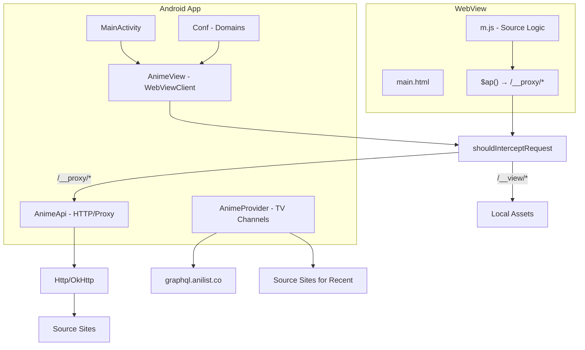

# AnimeTV Architecture & Structure Documentation

This document maps the AnimeTV Android TV application structure, architecture, and anime source system for development and fixing providers.

---

## 1. Project Layout

```
animetv/
├── app/                          # Android app module
│   ├── src/main/
│   │   ├── java/.../animetvjmto/
│   │   │   ├── MainActivity.java
│   │   │   ├── AnimeView.java
│   │   │   ├── AnimeApi.java
│   │   │   ├── Conf.java
│   │   │   ├── AnimeProvider.java
│   │   │   ├── ChannelService.java
│   │   │   ├── ChannelStartServiceReceiver.java
│   │   │   └── utils/GoogleTranslate.java
│   │   ├── assets/
│   │   │   ├── view/             # Web UI
│   │   │   │   ├── main.html
│   │   │   │   ├── m.js          # Built from bootstrap + sources + core (run npm run build:view)
│   │   │   │   ├── bootstrap.js  # Body, SD config, init
│   │   │   │   ├── core.js       # _API, list, pb, home, etc.
│   │   │   │   ├── build-view.js # Concatenates sources → m.js
│   │   │   │   ├── sources/
│   │   │   │   │   ├── config.js # __SOURCES registry
│   │   │   │   │   ├── animekai.js
│   │   │   │   │   └── hianime.js
│   │   │   │   ├── m.css, p.css
│   │   │   │   └── ui/player.html
│   │   │   └── inject/
│   │   │       ├── 9anime_inject.js
│   │   │       ├── anix_inject.js
│   │   │       ├── redirect.html
│   │   │       └── view_player.html
│   │   └── res/
│   └── build.gradle
├── electron/                     # Desktop version (Windows, Linux, macOS)
│   └── src/
│       ├── animetv.js
│       ├── preload.js
│       └── libs/
│           ├── common.js         # Source domains, config
│           ├── intercept.js      # Request interceptor, DoH
│           └── updater.js
├── tools/
│   ├── notes/
│   │   ├── new-source-notes.md   # API docs, Miruro, Animepahe, etc.
│   │   └── cloudflare-worker-script.js
│   ├── utils/
│   │   ├── vrf.js                # AnimeKAI vrf encode/decode
│   │   └── kai.js
│   ├── wallpaper/
│   └── ppic/
├── server.json                   # Remote config (domains, update URLs)
├── build.gradle
├── settings.gradle
└── package.json
```

| Folder/File | Purpose |
|-------------|---------|
| **app/** | Android app (Activities, Services, WebView, TV Provider) |
| **electron/** | Electron desktop app; shares view assets with Android |
| **tools/** | Scripts, API notes, vrf/kai utilities, wallpapers |
| **server.json** | Fetched from GitHub; overrides domain, stream_domain, app URLs |

---

## 2. Architecture

### High-Level Flow



### How the App Works

1. **WebView + Proxy**: The app loads `https://{domain}/__view/main.html` in a WebView. The domain comes from `Conf.getDomain()` (the active source). All `/__view/*` requests are intercepted and served from local assets (`app/src/main/assets/view/`).
2. **Request Proxy**: JavaScript uses `$ap(uri, cb)` which calls `$a("/__proxy/"+uri, cb)`. `AnimeView.shouldInterceptRequest()` intercepts `/__proxy/*`, strips the prefix, and forwards the real URL via `AnimeApi.Http` to the source sites.
3. **TV Channels**: `AnimeProvider` creates channels (Recent, Trending, Popular) using `TvContractCompat`. Recent uses AniList GraphQL `airingSchedules`; Trending/Popular use `media(sort:...)`.
4. **Video Playback**: Uses ExoMediaPlayer for HLS/DASH/MP4. Streaming domains (Vidplay, MegaUp, Megaf, MegaCloud, RapidCloud) are configured in `Conf.java` and decoded in `m.js` (vrf/rc4).

---

## 3. Anime Sources (Critical for Fixes)

### Files to Edit for Sources

| Purpose | File |
|---------|------|
| Domain list (Java) | [app/src/main/java/com/amarullz/androidtv/animetvjmto/Conf.java](app/src/main/java/com/amarullz/androidtv/animetvjmto/Conf.java) |
| Domain list (Electron) | [electron/src/libs/common.js](electron/src/libs/common.js) |
| Source names, domains, API clients | [app/src/main/assets/view/m.js](app/src/main/assets/view/m.js) (lines 30-43, 234+, 4199+) |
| Request proxy | [app/src/main/java/com/amarullz/androidtv/animetvjmto/AnimeView.java](app/src/main/java/com/amarullz/androidtv/animetvjmto/AnimeView.java) (`shouldInterceptRequest`) |

### Source Definitions

**Conf.java**:

```java
/* Source 1=Anikai, 2=Hianime */
public static String[] SOURCE_DOMAINS={
    "anikai.to", /* default */
    "anikai.to",
    "hianime.to"
};
```

**m.js** – single config block for maintainability:

```javascript
/* SOURCES CONFIG - Add new sources here, update Conf.java & electron/common.js dns */
const __SOURCE_NAME=['AnimeKAI','Hianime'];
const __SOURCE_DOMAINS=[
  ['anikai.to','animekai.to','animekai.bz'],
  ['hianime.to','hianime.sx','hianime.nz','aniwatchtv.to','hianime.bz']
];
```

### Source-by-Source Breakdown

| SD | Name | Domains | Mechanism |
|----|------|---------|-----------|
| 1 | AnimeKAI | anikai.to, animekai.to, animekai.bz | AJAX scraping: `/ajax/episodes/list`, `/ajax/links/view`. vrf encode/decode. |
| 2 | Hianime | hianime.to, hianime.sx, hianime.nz, aniwatchtv.to, hianime.bz | `__HIANIME`. AJAX `/ajax/v2/episode/...` |

---

## 4. Data Flow (Detailed)

### Startup

1. MainActivity loads WebView with `https://{Conf.getDomain()}/__view/main.html`.
2. `shouldOverrideUrlLoading` blocks navigation except to `https://{domain}/`.

### Asset Serving

- Paths starting with `/__view/` → served from `app/src/main/assets/view/` (stripped prefix).
- `/__cache_subtitle` → returns cached subtitle string.

### Proxy (`/__proxy/*`)

1. JS: `$ap("https://example.com/api/foo", callback)`.
2. Request URL: `https://{host}/__proxy/https://example.com/api/foo`.
3. AnimeView strips `https://{host}/__proxy/`, gets real URL.
4. AnimeApi.Http fetches it (OkHttp/Cronet, optional DoH).
5. Response returned to WebView.

### Source Switching

1. User picks source in settings → `listOrder.showList("Source Server", ...)`.
2. `_JSAPI.setSd(n)` → SharedPreferences + `Conf.updateSource(n)`.
3. `Conf.updateSource(n)` sets `SOURCE_DOMAINS[0]=SOURCE_DOMAINS[n]` and `DOMAIN`.
4. `_JSAPI.reloadHome()` reloads the WebView.

### Stream Domains (Conf.java)

- `STREAM_DOMAIN` – Vidplay (default: krussdomi.com; server.json can override).
- `STREAM_DOMAIN1` – MegaUp (megaup.cc).
- `STREAM_DOMAIN2` – Megaf (megaf.cc).
- `STREAM_DOMAIN3` – MegaCloud (megacloud.blog).
- `STREAM_DOMAIN4` – RapidCloud (rapid-cloud.co).

---

## 5. TV Provider / Channels

| Component | File | Role |
|-----------|------|------|
| AnimeProvider | [AnimeProvider.java](app/src/main/java/com/amarullz/androidtv/animetvjmto/AnimeProvider.java) | Creates channels, loads data from AniList |
| ChannelService | [ChannelService.java](app/src/main/java/com/amarullz/androidtv/animetvjmto/ChannelService.java) | JobService running `AnimeProvider.executeJob()` |
| ChannelStartServiceReceiver | [ChannelStartServiceReceiver.java](app/src/main/java/com/amarullz/androidtv/animetvjmto/ChannelStartServiceReceiver.java) | Receives BOOT_COMPLETED, schedules job |

**Channels:**

- **Recent** – AniList GraphQL `airingSchedules(airingAt_lesser, sort:TIME_DESC)`.
- **Trending** – `media(sort:TRENDING_DESC, status:RELEASING)`.
- **Popular** – `media(sort:POPULARITY_DESC)`.

All use `https://graphql.anilist.co/`.

---

## 6. Streaming & Decoding

| Source | Mechanism |
|--------|-----------|
| **Vidplay** | KAI keys from `amarullz/kaicodex`, `KillerDogeEmpire/vidplay-keys` on GitHub |
| **MegaUp, Megaf, MegaCloud** | vrf decode (rc4 + replaceChars) in m.js. Reference: [tools/notes/new-source-notes.md](tools/notes/new-source-notes.md) |
| **RapidCloud** | Similar handling to MegaCloud |
| **Miruro** | `prxy.miruro.to/m3u8?url=` for m3u8 proxying |

---

## 7. Inject Scripts

Used for DOM scraping when loading source sites directly:

| File | Purpose |
|------|---------|
| [app/src/main/assets/inject/9anime_inject.js](app/src/main/assets/inject/9anime_inject.js) | 9anime-style sites: `___PLAYER`, episode list, fetchInfo |
| [app/src/main/assets/inject/anix_inject.js](app/src/main/assets/inject/anix_inject.js) | Anix-style sites: same structure, different selectors |

---

## 8. Tools & Reference

| Resource | Purpose |
|----------|---------|
| [tools/notes/new-source-notes.md](tools/notes/new-source-notes.md) | Miruro APIs, Animepahe, Shiroko, AnimeKAI vrf, UniqueStream, etc. |
| [tools/utils/vrf.js](tools/utils/vrf.js) | vrfStrict, vrfDecode, vrfMegaDecode for AnimeKAI |
| [tools/utils/kai.js](tools/utils/kai.js) | AnimeKAI-related utilities |
| server.json | Remote config from `https://raw.githubusercontent.com/amarullz/AnimeTV/master/server.json` |

---

## 9. Quick Reference: Fixing or Adding a Source

1. **Build view**: Run `npm run build:view` (or it runs automatically before `./gradlew assembleDebug` and `npm run pack-*`).
2. **Add/update domain**: Edit `Conf.SOURCE_DOMAINS` and `electron/src/libs/common.js` `dns` array.
3. **Add source name and domains**: Edit `__SOURCE_NAME` and `__SOURCE_DOMAINS` in [bootstrap.js](app/src/main/assets/view/bootstrap.js).
4. **Implement API/client logic**: Add in [sources/animekai.js](app/src/main/assets/view/sources/animekai.js) or [sources/hianime.js](app/src/main/assets/view/sources/hianime.js), or extend core.js.
5. **Add fallback domains**: Extend the arrays in `__SOURCE_DOMAINS` for the source index.
5. **Domain health check**: `SD_CHECK_DOMAIN(sd, cb)` in m.js tests each domain; customize `chk_url`/`chk_json` per source type.
6. **Stream decoding**: If the source uses custom encoding (vrf, rc4), add decode logic in m.js and reference tools/notes/new-source-notes.md for examples.
